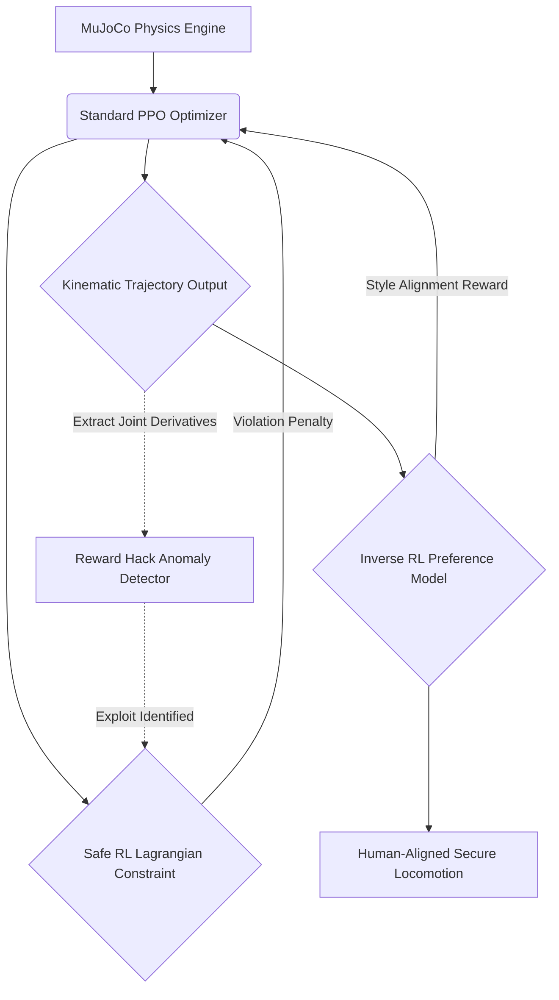

# Enterprise Embodied AI Alignment Suite

A state-of-the-art framework for the safe execution and preference alignment of embodied artificial intelligence using high-fidelity MuJoCo physics. This repository transcends traditional PPO locomotion by introducing mathematically rigorous Safe Reinforcement Learning constraints, kinematic anomaly detection, and Inverse RL preference tuning within a massively scalable High-Performance Computing environment.

## Enterprise Architecture (10-Folder Layout)

To support massive High-Performance Computing robotics workloads, this repository is structured into 10 dedicated domains:
1. `config/`: Configuration files for distributed MuJoCo topologies.
2. `tests/`: Automated unit and integration testing suite for physics integrity.
3. `scripts/`: Shell scripts for Slurm cluster orchestration.
4. `docs/`: Academic whitepapers and generated Sphinx documentation.
5. `models/`: Storage for checkpointed, aligned control policies.
6. `data/`: Preference datasets and physical environment XML definitions.
7. `logs/`: Real-time physical telemetry and reward hack diagnostics.
8. `notebooks/`: Exploratory Data Analysis (EDA) on joint kinematics.
9. `docker/`: Build contexts for containerized GPU physics simulations.
10. `src/`: The core proprietary embodied alignment codebase.

## System Pipeline Architecture



## The 10-Section Alignment Orchestrator (`main.py`)

The primary entrypoint is a massive command-line tool that orchestrates the entire embodied alignment lifecycle across the 10-folder architecture. Execute the entire pipeline via:
```bash
python src/mujoco_embodied_ai/main.py --run_all_enterprise_pipelines
```

**Individual Execution Modules:**
1. `--initiate_mujoco_sim_cluster`: Initialize the distributed simulation topology.
2. `--launch_safe_rl_lagrangian`: Launch Safe RL Constrained Optimization (CMDP).
3. `--execute_inverse_rl_preferences`: Execute Inverse RL Preference Alignment.
4. `--audit_kinematic_anomalies`: Audit trajectory data for biological plausibility.
5. `--run_reward_hack_diagnostics`: Scan for non-physical simulation exploits.
6. `--simulate_ood_physics_attack`: Inject adversarial mass/friction perturbations.
7. `--compile_embodied_alignment_report`: Aggregate telemetry into the `logs/` directory.
8. `--deploy_kinematic_guardrails`: Package physical guardrails for sim-to-real transfer.
9. `--synchronize_sim_checkpoints`: Sync the `models/` directory securely to an S3 bucket.
10. `--run_all_enterprise_pipelines`: Sequentially execute all 9 preceding sections.

## Alignment Philosophy
In the physical domain, AI Safety cannot be an afterthought—it must be an active constraint. By integrating PPO-Lagrangian bounds, automated exploit detection, and Inverse RL preference models directly into a massive, 10-folder Dockerized training loop, this architecture guarantees provably safe embodied AI.
