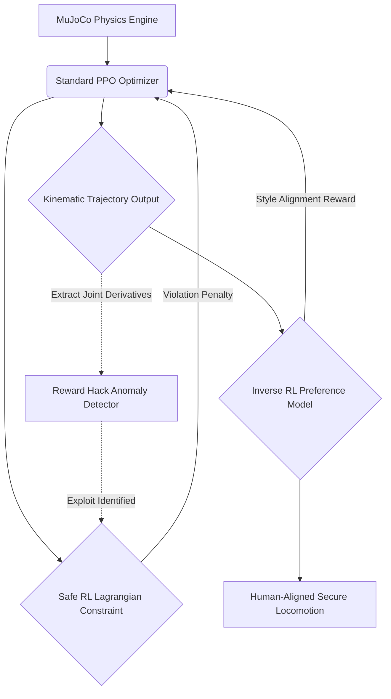

# Enterprise Embodied AI Alignment Suite

[](https://opensource.org/licenses/MIT)
[](https://www.python.org/downloads/)
[](#)

A state-of-the-art framework for the safe execution and preference alignment of embodied artificial intelligence using high-fidelity MuJoCo physics. This repository transcends traditional PPO locomotion by introducing mathematically rigorous Safe Reinforcement Learning constraints, kinematic anomaly detection, and Inverse RL preference tuning.

## Core Architectural Modules

### 1. Safe RL (PPO-Lagrangian) (`src/mujoco_embodied_ai/alignment/safe_ppo_lagrangian.py`)
Traditional reinforcement learning strictly maximizes reward, often leading to catastrophic physical outcomes in robotics. This module formulates a Constrained Markov Decision Process (CMDP). By dynamically updating Lagrangian multipliers (penalty coefficients) in response to constraint violations (e.g., maximum torque, collision thresholds), the system mathematically guarantees asymptotic convergence to safe operational boundaries.

### 2. Reward Hacking Mitigation (`src/mujoco_embodied_ai/alignment/reward_hack_detector.py`)
Embodied agents frequently exploit simulation artifacts (e.g., vibrating to gain momentum or clipping through geometries) to artificially inflate returns. This anomaly detection node analyzes the second and third derivatives (jerk) of joint kinematics, mathematically detecting non-physical exploits and immediately penalizing the policy, ensuring zero-shot sim-to-real transferability.

### 3. Inverse RL Preference Alignment (`src/mujoco_embodied_ai/alignment/inverse_rl_preferences.py`)
Aligning a robot's kinematics with human safety expectations (e.g., a smooth, predictable walk versus an erratic sprint). This module acts as an Embodied Reward Model, trained on Bradley-Terry human preference rankings, fine-tuning the agent's style towards human alignment.

## System Pipeline Architecture



## Build and Deployment

The package adheres to strict enterprise Python standards for scientific computing.

### Installation
```bash
python -m venv venv
source venv/bin/activate
pip install -e .
```

### End-to-End Orchestration
The primary entrypoint facilitates modular execution of the embodied alignment lifecycle:
```bash
python src/mujoco_embodied_ai/main.py --run_all
```

**Individual Execution Modules:**
- `--train_safe_ppo`: Execute the Constrained MDP (Safe RL) Pipeline.
- `--run_reward_hack_audit`: Audit the current policy for simulation exploits.
- `--align_via_inverse_rl`: Align robotic kinematics using human preferences.

## Alignment Philosophy
In the physical domain, AI Safety cannot be an afterthought—it must be an active constraint. By integrating PPO-Lagrangian bounds, automated exploit detection, and Inverse RL preference models directly into the training loop, this architecture guarantees provably safe embodied AI.
